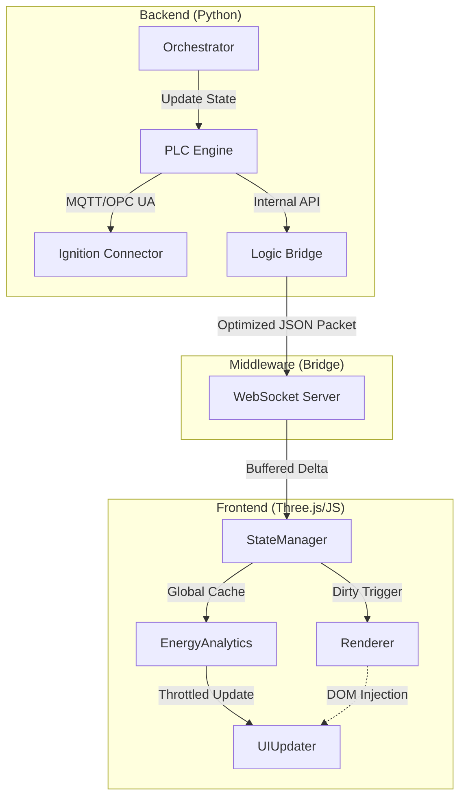

# System Architecture

The Digital Twin is a vertical integration of three independent layers: **Physical Simulation**, **Virtual PLC Logic**, and **3D Visualization**. This division ensures minimal coupling and allows for individual component swaps (e.g., swapping the simulated backend for a real SCADA system).

---

## 1. Data Flow & Sync

The system utilizes an optimized data pipeline to achieve sub-second latency across 21 devices and hundreds of telemetry tags.



### Component Roles

| Component | Responsibility | Performance Target |
| :--- | :--- | :--- |
| **Orchestrator** | Manages material flow (WIP), transformation logic, and machine duty cycles. | 1s Tick |
| **PLC Engine** | Maintains the "Ground Truth" for all tags (Alarm, Process, Energy). | <100ms Write |
| **Logic Bridge** | Aggregates all PLC tag changes into a single high-efficiency WebSocket broadcast. | <50ms Sync |
| **StateManager** | Normalizes raw tag names into a consistent internal structure. | O(1) Lookup |
| **EnergyAnalytics** | Processes high-frequency telemetry to compute derived OEE and load metrics. | 500ms Throttle |
| **Renderer** | Handles 3D model loading, camera transitions, and device-level color coding. | 60 FPS |

---

## 2. Communication Strategy

### 📥 Inbound (WebSocket)
The frontend connects to `ws://localhost:8001/ws` and receives a consolidated state object every 500-1000ms. The bridge only broadcasts if tag values have changed, reducing network overhead.

### 📤 Outbound (Control & Faults)
Commands (Start, Stop, Fault) are sent back to the bridge via the same WebSocket. The bridge then writes these values to the corresponding PLC tags in the back end.

```json
{
  "type": "write",
  "node_id": "VirtualPLC.Devices.FURNACE_01.Inputs.Start",
  "value": true
}
```

---

## 3. Key Design Patterns

### Throttled DOM Updates
The UI does *not* re-render on every WebSocket frame. The `UIUpdater` uses a 500-1000ms loop to poll the `StateManager` and `EnergyAnalytics` results, ensuring the main thread remains free for smooth 60 FPS Three.js rendering.

### Normalized ID Mapping
To bridges the gap between the Backend IDs (`OUTBOUND_01`) and the UI Aliases (`SHIPPING`), the system uses a normalization layer. This ensures that a single tag update propagates correctly to the 3D mesh, the left sidebar list, and the right analytics panel.

### Context Preservation
When switching between views (e.g., Plant Overview → Zone View → Machine Detail), the app preserves the previous state. For example, selecting a machine "Ghosts" the rest of the factory using a shader material to maintain spatial awareness without visual clutter.
