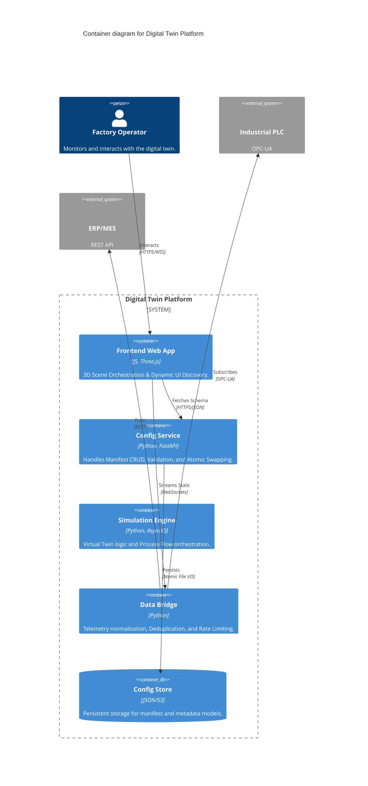

# Universal Digital Twin: Enterprise System Design Specification

## 1. Executive Summary
This document defines a model-driven, templatized architecture for an industrial Digital Twin platform. The system decouples physical layout, 3D visualization, and telemetry mapping from the source code, allowing for rapid scaling across diverse manufacturing environments.

---

## 2. System Architecture (C4 Container Diagram)



---

## 3. Resilience & Operation Patterns

To ensure industrial-grade stability, the following patterns are enforced across all containers:

### 3.1 Idempotency (State Consistency)
*   **Unique Entity IDs**: All machines and assets must use a system-wide Unique ID (e.g., `CNC_01`). 
*   **UPSERT Logic**: The `Config Service` uses idempotency keys for all mutation operations. Sending the same "Create Machine" request multiple times results in exactly one machine being created.

### 3.2 Report-By-Exception (RBE) & Deduplication
*   **Change-Only Updates**: The `Data Bridge` maintains a "Last Value" cache for every tag. 
*   **Deduplication**: Packets are only dispatched to the Frontend if `current_value != last_value` or if a `heartbeat_interval` has elapsed. This prevents network congestion from static sensors.

### 3.3 Atomic Configuration Swapping
*   **Staging Pattern**: Configuration updates follow a `Prepare -> Validate -> Swap` sequence.
*   **Shadow Write**: New manifests are written to a `.tmp` file. Once verified, the system atomically renames the file to the active manifest, ensuring zero-downtime and zero-corruption during updates.

### 3.4 Rate Limiting & Backpressure
*   **Throttling**: The `Data Bridge` enforces a per-machine update ceiling (e.g., 10Hz). 
*   **Backpressure**: If the Frontend cannot process frames fast enough, the WebSocket client drops intermediate packets to prioritize the most recent state.

---

## 4. Configuration Schema Design

### 4.1 Site Manifest (The Blueprint)
Defines the "What" and "Where".
```json
{
  "site_id": "FACTORY_A",
  "instances": [
    {
      "id": "FURNACE_01",
      "type": "THERMAL_UNIT",
      "transform": { "pos": [0,0,0], "rot": [0,1.57,0] },
      "data_bindings": { "temp": "ns=2;s=Furnace.ActualTemp" }
    }
  ]
}
```

### 4.2 Telemetry Dictionary (The Translator)
Defines the "How".
```json
{
  "mappings": [
    {
      "logical_path": "temp",
      "source": {
        "type": "opcua",
        "address": "ns=2;s=Furnace.ActualTemp"
      },
      "ui": { "label": "Melt Temp", "unit": "°C", "category": "THERMAL" }
    },
    {
      "logical_path": "order_id",
      "source": {
        "type": "rest",
        "url": "https://mes.factory.com/api/v1/current-order",
        "path": "$.order_number",
        "polling_interval_sec": 10
      },
      "ui": { "label": "Active Order", "category": "LOGISTICS" }
    }
  ]
}
```

---

## 5. Data Flow Sequence

```mermaid
sequenceDiagram
    participant FE as Frontend Engine
    participant API as Config Service
    participant DB as Data Bridge
    participant PLC as External PLC

    Note over FE, PLC: Bootstrap Sequence
    FE->>API: GET /site-manifest
    API-->>FE: Return JSON (IDs, Models, Coords)
    FE->>FE: Build 3D Scene (Asset Caching)
    
    Note over FE, PLC: Telemetry Loop
    PLC->>DB: Tag Update (ns=2;s=temp = 450.5)
    DB->>DB: Deduplicate (Has value changed?)
    DB->>DB: Apply Dictionary (Label, Unit, Category)
    DB-->>FE: WSS: { id: "FURNACE_01", temp: 450.5 }
    FE->>FE: Update Highlight & Sidebar
```

---

## 6. Caching Strategy
*   **Static Assets**: `Cache-Control: public, max-age=31536000`

### 2.4 Data Bridge (Hybrid Connectivity Layer)
*   **Protocol Translation**: Normalizes varied protocols (OPC-UA, MQTT, REST, SQL).
*   **Polling-to-Streaming Engine**: For REST API sources, the Bridge performs asynchronous polling and transforms the responses into a real-time WebSocket stream for the UI.
*   **Telemetry Normalization**: Applies the `Telemetry Dictionary` rules to format raw data for the UI.

### 2.5 Configuration Store (Hybrid Persistence)
*   **Multi-Source Booting**: The system can initialize from local JSON files or a Remote Configuration URL.
*   **Local-First Fallback**: If a Remote URL is specified but unreachable, the store initializes from a local persistent cache to ensure system availability.
*   **CORS**: Restricted to approved frontend domains.
*   **Encryption**: WSS (Secure WebSockets) and HTTPS required for all production traffic.

---

## 7. Security Architecture
*   **Authentication**: JWT-based auth for all `Config Service` mutations.
*   **CORS**: Restricted to approved frontend domains.
*   **Encryption**: WSS (Secure WebSockets) and HTTPS required for all production traffic.
